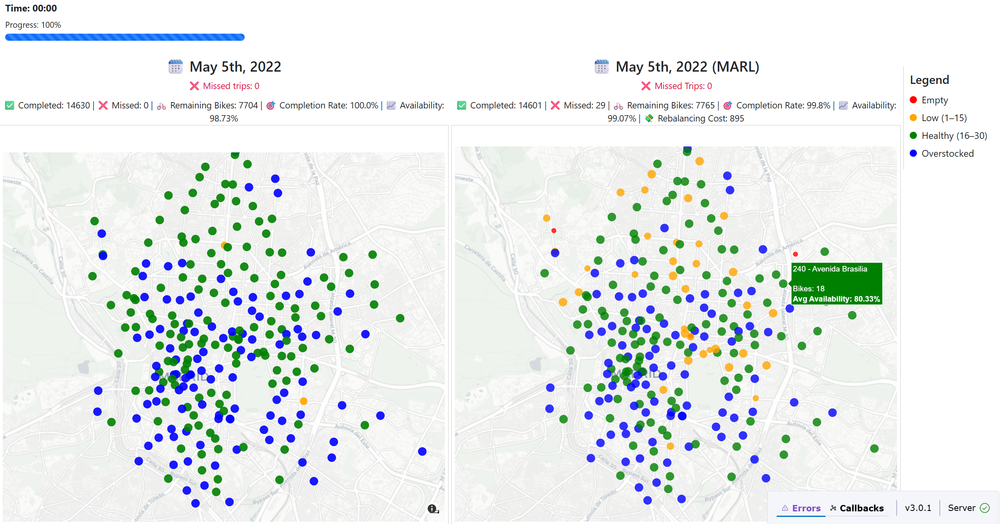

# Madrid Bike-Sharing Simulation
A real-time simulation of bike-sharing activity in Madrid using historical trip data and live map visualizations. This project displays station activity across a 24-hour period compressed into a 5-minute live simulation using Dash and Plotly.

**Detailed information**
- https://hackmd.io/@AudlaQKrRO-pFcMAxcX4Fg/SJXLaazayl
---
## Goal
The project serves as a base for comparing:
- **(1) Base Scenario** 
  - Simulates the basic movement of bikes from one station to another. This tests the basic functioning of the system under typical user behavior without external intervention.
- **(2) Demand-Based Redistribution**
  - Redistribute bikes during off-peak hours based on historical demand data to balance supply at docking stations. Predict peak demand locations and times to preemptively allocate resources effectively. 
- **(3) Infrastructure Changes**
  - Simulate the effect of adding, removing, or relocating stations in the network. Evaluate how changes in infrastructure impact system performance and user behavior.
  - Example: Adding a new station in a high-demand area reduces strain on nearby stations.
---
## Features
- Live updating map of bike stations in Madrid
- Simulates historical bike trip data from:
  - **May 5th, 2022**
  - **May 11th, 2022** *(busiest day)*
- Time-compressed simulation (24h → 5 min)
- Interactive progress bar and hover tooltips
- Color-coded station markers based on real-time availability
- Missed trip logging
- Realistic Trip Handling
- Top missed stations (where most missed trips occurred)
- Station-Level Trip Statistics Tracking
- Station status indicators: busy, underused, always empty/full, balanced
- Configurable Initial Station Stock
- Incoming + Outgoing Trip Counts per Station
- Missed trips visualized on the map
- Percentage of time when stations are healthy
- Redistribution between 03:00–04:00 and 12:00–13:00
---
### **New**
- Evaluation Metrics:
  - Completed & missed trips
  - Completion rate
  - Rebalancing cost
  - Average availability rate
- Stations stats updated
---
### **Coming Next:** DQN Rebalancing

Next major step: Implement a Multi-Agent DQN where each station becomes a decision-making agent that learns to:
- Predict high-demand stations and rebalance accordingly
- Minimize missed trips and improve system performance
- Learn actions during off-peak hours (03:00–04:00 and 12:00–13:00)
---

---
## Dataset
- `tripdata_2022.csv`: full Madrid dataset for 2022
- `all_stations.csv`: contains all station locations (lat/lon), names, and IDs
- `all_trips_05_05.csv` & `all_trips_05_11.csv`: real bike trip with:
  - `start_time`, `end_time`
  - `start_station_id`, `end_station_id`
---
## Setup Instructions
- make sure you first have `all_stations.csv` , `all_trips_05_05.csv` and `all_trips_05_11.csv` files
- then run `python app.py`
