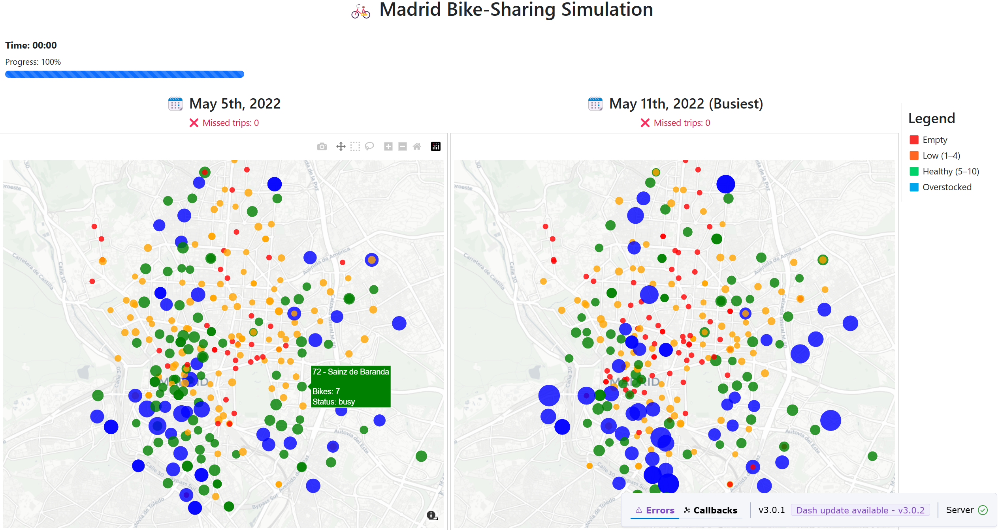

# Madrid Bike-Sharing Simulation

A real-time simulation of bike-sharing activity in Madrid using historical trip data and live map visualizations. This project displays station activity across a 24-hour period compressed into a 5-minute live simulation using Dash and Plotly.

---

## Features

- Live updating map of bike stations in Madrid
- Simulates historical bike trip data from:
  - **May 5th, 2022**
  - **May 11th, 2022** *(busiest day)*
- Time-compressed simulation (24h → 5 min)
- Interactive progress bar and hover tooltips
- Color-coded station markers based on real-time availability
  - 🟥 Empty (0 bikes)
  - 🟧 Low (1–4 bikes)
  - 🟩 Healthy (5–10 bikes)
  - 🟦 Overstocked (>10 bikes)

**New**
- Missed trip logging
  - Trips that cannot start due to empty stations are logged in a `missed_trips.csv` file. Each log includes trip ID, start and end times, station IDs, and the simulated day. The app also displays the total number of missed trips in real time.
- Realistic Trip Handling
  - Bikes are now returned to their destination stations only when the trip ends (based on actual trip duration), rather than immediately when the trip starts. 

**TO DO next**
- Top missed stations (where most missed trips occurred)
- Station status indicators: busy, idle, always empty/full

---

## Goal

The project serves as a base for comparing:
- **(1) Base Scenario** 
  - Simulates the basic movement of bikes from one station to another. This tests the basic functioning of the system under typical user behavior without external intervention.
- **(2) Demand-Based Redistribution**
  - Redistribute bikes during off-peak hours based on historical demand data to balance supply at docking stations. Predict peak demand locations and times to preemptively allocate resources effectively. 
- **(3) Infrastructure Changes**
  - Simulate the effect of adding, removing, or relocating stations in the network. Evaluate how changes in infrastructure impact system performance and user behavior.
  - Example: Adding a new station in a high-demand area reduces strain on nearby stations.
---

## Dataset

- `tripdata_2022.csv`: full Madrid dataset for 2022
- `all_stations.csv`: contains all station locations (lat/lon), names, and IDs
- `all_trips_05_05.csv` & `all_trips_05_11.csv`: real bike trip with:
  - `start_time`, `end_time`
  - `start_station_id`, `end_station_id`

---

## 🚀 Setup Instructions

- make sure you first have `all_stations.csv` , `all_trips_05_05.csv` and `all_trips_05_11.csv` files
- then run `python app.py`
